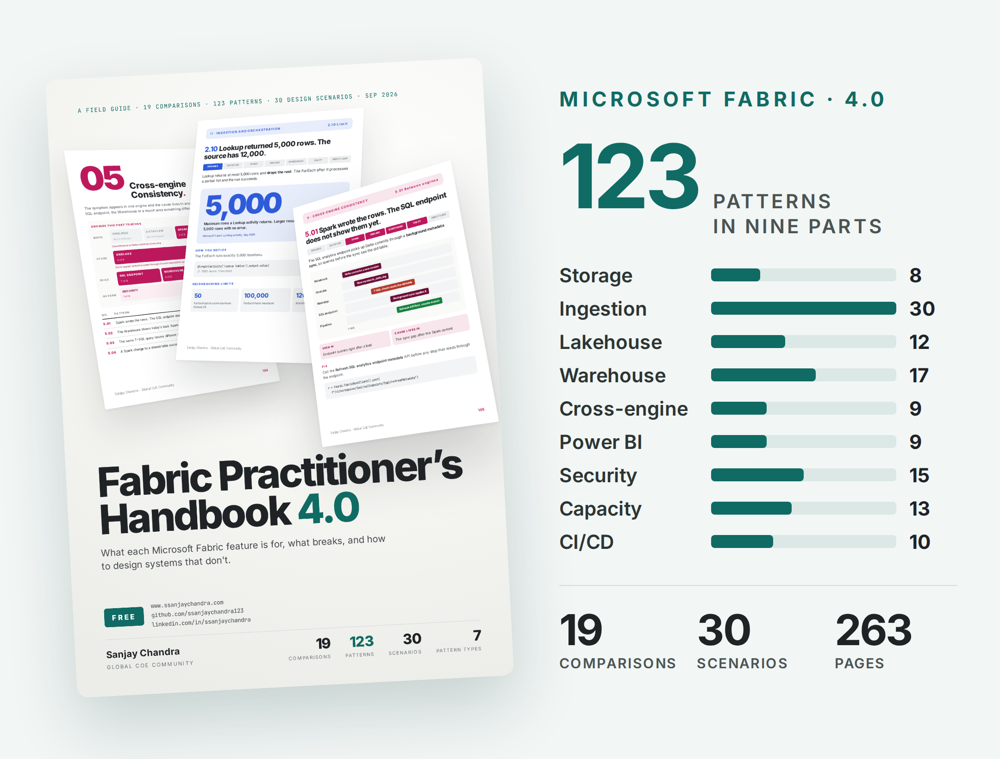
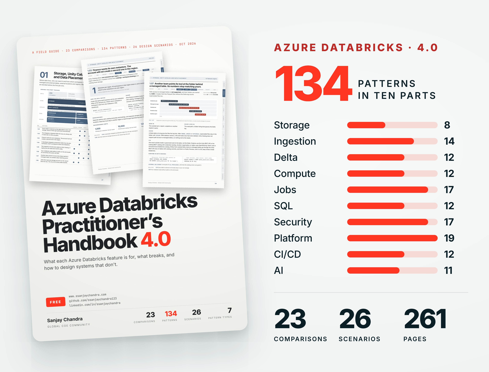
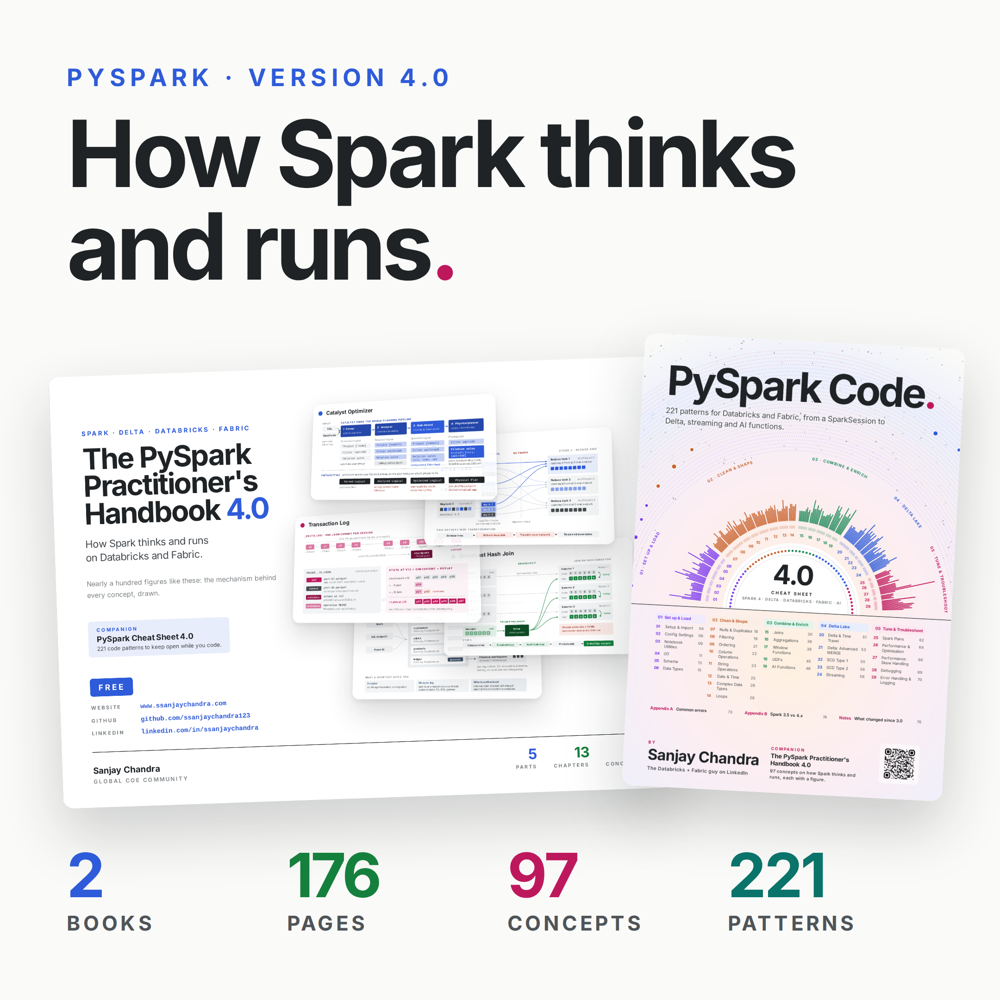
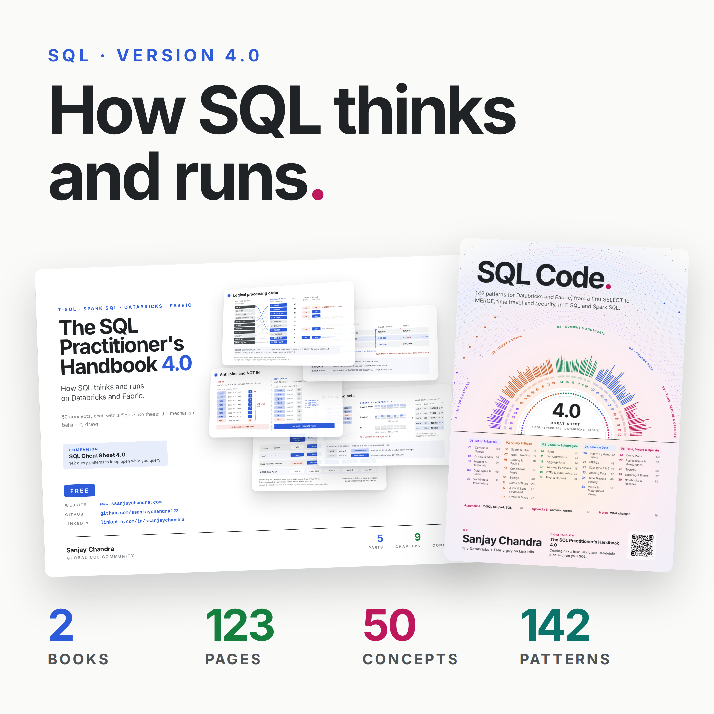

# Data Engineering Patterns

Free handbooks, cheat sheets, and pattern books for Microsoft Fabric, Azure Databricks, PySpark, and SQL, drawn from real data platform engagements. Each one explains how the platform actually works and which decision to make in production.

> **One home for all of my data engineering material,** with more platforms and tools added over time. Star the repo and check back as it grows.

---

## Microsoft Fabric

  

What each Fabric feature is, how it behaves in production, and how to design with it. One handbook that replaces the five Fabric Engineering Patterns books.

**[Download The Fabric Practitioner's Handbook 4.0 (PDF)](https://github.com/ssanjaychandra123/data-engineering-patterns/blob/main/Fabric%20Patterns/Fabric%20Practitioners%20Handbook%204.0%20by%20Sanjay%20Chandra.pdf)**
---

## Azure Databricks Patterns

  

350 patterns covering the full platform, from clusters and Delta Lake through Unity Catalog governance to the architecture and cost choices that keep it sustainable.

| # | Topic | Download |
|---|---|---|
| 1 | Clusters and Compute | [Download PDF](https://github.com/ssanjaychandra123/data-engineering-patterns/blob/main/Databricks%20Patterns/Azure%20Databricks%20Engineering%20Patterns%20Book%20I%20-%20Clusters%20and%20Compute%20by%20Sanjay%20Chandra.pdf) |
| 2 | Delta Lake | [Download PDF](https://github.com/ssanjaychandra123/data-engineering-patterns/blob/main/Databricks%20Patterns/Azure%20Databricks%20Engineering%20Patterns%20Book%20II%20-%20Delta%20Lake%20by%20Sanjay%20Chandra.pdf) |
| 3 | Workflows and Orchestration | [Download PDF](https://github.com/ssanjaychandra123/data-engineering-patterns/blob/main/Databricks%20Patterns/Azure%20Databricks%20Engineering%20Patterns%20Book%20III%20-%20Workflows%20and%20Orchestration%20by%20Sanjay%20Chandra.pdf) |
| 4 | Structured Streaming and Auto Loader | [Download PDF](https://github.com/ssanjaychandra123/data-engineering-patterns/blob/main/Databricks%20Patterns/Azure%20Databricks%20Engineering%20Patterns%20Book%20IV%20-%20Structured%20Streaming%20and%20Auto%20Loader%20by%20Sanjay%20Chandra.pdf) |
| 5 | Unity Catalog | [Download PDF](https://github.com/ssanjaychandra123/data-engineering-patterns/blob/main/Databricks%20Patterns/Azure%20Databricks%20Engineering%20Patterns%20Book%20V%20-%20Unity%20Catalog%20by%20Sanjay%20Chandra.pdf) |
| 6 | Databricks SQL and Photon | [Download PDF](https://github.com/ssanjaychandra123/data-engineering-patterns/blob/main/Databricks%20Patterns/Azure%20Databricks%20Engineering%20Patterns%20Book%20VI%20-%20Databricks%20SQL%20and%20Photon%20by%20Sanjay%20Chandra.pdf) |
| 7 | Platform and Cost Architecture | [Download PDF](https://github.com/ssanjaychandra123/data-engineering-patterns/blob/main/Databricks%20Patterns/Azure%20Databricks%20Engineering%20Patterns%20Book%20VII%20-%20Platform%20and%20Cost%20Architecture%20by%20Sanjay%20Chandra.pdf) |

---

## PySpark

  

How Spark thinks and runs on Databricks and Fabric, with a figure for every concept, plus a cheat sheet of code to keep open while you work.

| Title | Download |
|---|---|
| The PySpark Practitioner's Handbook 4.0 | [Download PDF](https://github.com/ssanjaychandra123/data-engineering-patterns/blob/main/PySpark/PySpark%20Practitioners%20Handbook%204.0%20by%20Sanjay%20Chandra.pdf) |
| PySpark Cheat Sheet 4.0 | [Download PDF](https://github.com/ssanjaychandra123/data-engineering-patterns/blob/main/PySpark/PySpark%20Cheat%20Sheet%204.0%20by%20Sanjay%20Chandra.pdf) |

---

## SQL

  

How SQL thinks and runs on Fabric Warehouse and Databricks SQL, with a figure for every concept, plus a cheat sheet that puts T-SQL and Spark SQL side by side.

| Title | Download |
|---|---|
| The SQL Practitioner's Handbook 4.0 | [Download PDF](https://github.com/ssanjaychandra123/data-engineering-patterns/blob/main/SQL/SQL%20Practitioners%20Handbook%204.0%20by%20Sanjay%20Chandra.pdf) |
| SQL Cheat Sheet 4.0 | [Download PDF](https://github.com/ssanjaychandra123/data-engineering-patterns/blob/main/SQL/SQL%20Cheat%20Sheet%204.0%20by%20Sanjay%20Chandra.pdf) |

---

Found a gap or something that has moved on? Open an issue. These platforms evolve quickly and I keep the material current. Compiled with Claude by Anthropic as a writing and research assistant. Every page was reviewed, edited, and validated by Sanjay Chandra.

---

Sanjay Chandra builds and advises on enterprise data platforms. If your team is wrestling with one of these problems at scale, let us talk.

[LinkedIn](https://www.linkedin.com/in/ssanjaychandra/) · [ssanjaychandra.com](http://www.ssanjaychandra.com)
